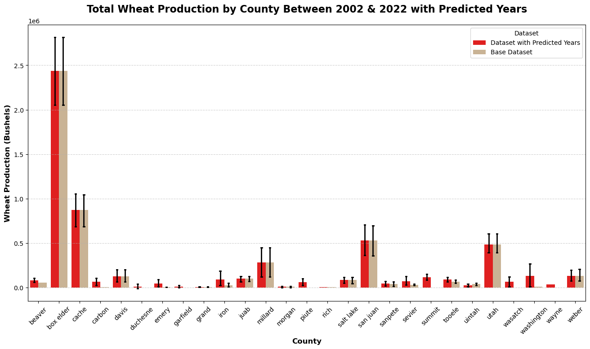
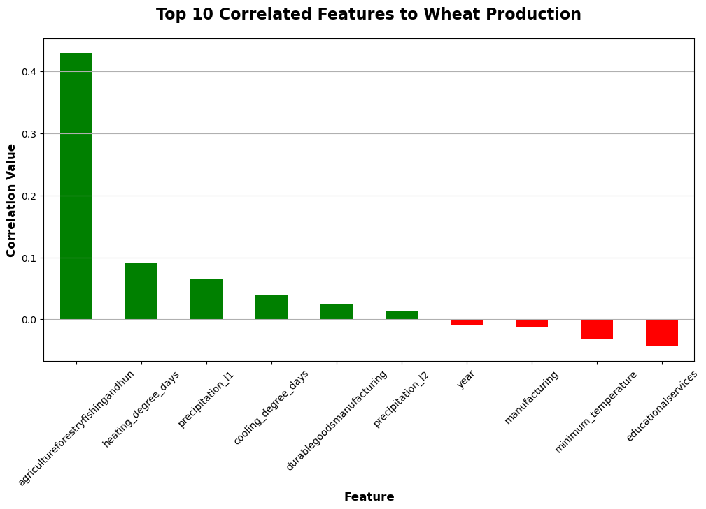
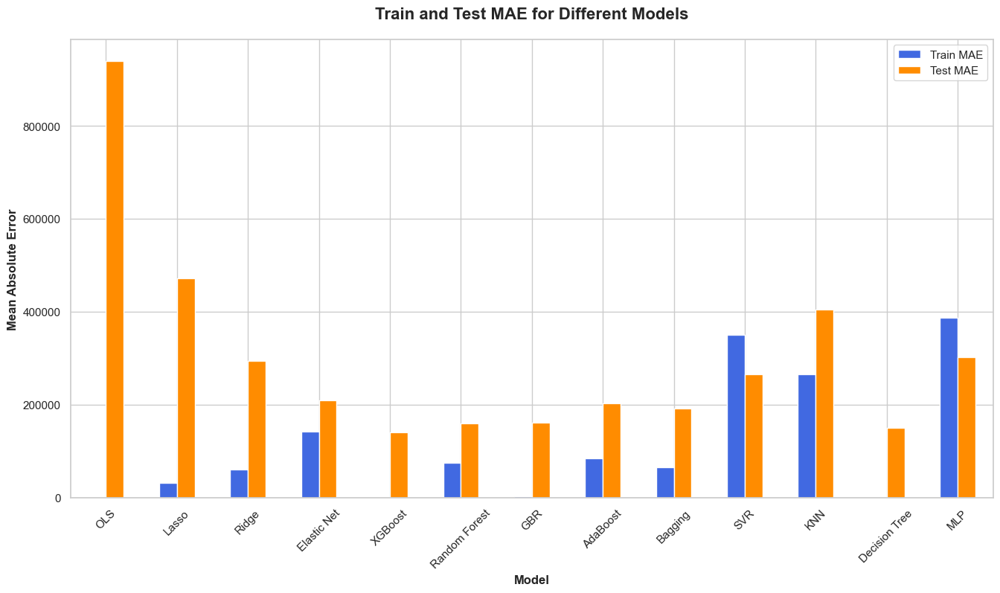

# Utah Agricultural Census: Wheat Production For Utah Counties (2002 - 2022)
In this work we attempt to fill in the gap years for the US Agricultural Census in Utah counties. Open source data from NOAA, Agricultural Census, and BLS are used leveraging Machine Learning methods and models.

## Content
- [Results](#results)
- [Motivation & Task](#motivation--task)
- [Folders & Files](#folders--files)
- [Data Set Features](#dataset-features)
- [Machine Learning Methods](#machine-learning-methods)
  - [Out of the Box Regression Model Performance](#out-of-the-box-regression-model-performance)
  - [Initial Evaluation: Elastic Net](#initial-evaluation-elastic-net)
  - [Fine Tuned Evaluation: XGBoost](#fine-tuned-evaluation-xgboost)
- [Authors](#authors)

## Results
The results show that some counties experienced a decrease in wheat production while some saw an increase. Different features that impacted this was based on estimated GPD from agricultural industries in each county. Another significant factor was precipitation levels and temperature.
### Comparison on Base Dataset vs Base with Predicted Gap Years

To see what factors were most correlated with wheat production the correlation matrix was calculated and the top 10 features were plotted to get a general idea of feature importance.
### Top 10 Most Correlated Features with Wheat Production

## Motivation & Task
The Agricultural Census releases data every 5 years. We will be using the data from past years to fill in the gaps for counties where the Agricultural Census was not conducted.
Valuable information for:
- Farmers/Ranchers
- Policymakers 
- Investors

## Folders & Files
- `data_merge_scripts`: Folder containing scripts for merging data.
- `gpd_data`: Contains all current data and processing files related to GDP data for each county.
- `initial_analysis`: Folder for initial data analysis scripts and files.
- `ml_model_finetuning`: Includes scripts and readme images folder for fine-tuning machine learning models.
- `pop_data`: Contains all current data and processing files related to population data.
- `presentation_material`: Contains all current data and processing files related to presentation materials.
- `readme_images`: Folder for storing images used in README files.
- `weather_data`: Folder containing scripts and files related to weather data processing.

## Dataset Features:

### All Features Measured on a County & Year Level from 2002 - 2022:

- `Wheat Prices`: Wheat prices for each county in $USD/Bushel.
- `Wheat Production`: Wheat production amount in Bushel units.
- `Weather Data`: Temperature, moisture index, precipitation, etc.
- `County Population`: Population for each county over the years.
- `GDP (by industry)`: GDP broken up into 27 different industries.

## Machine Learning Methods

### Out of the Box Regression Model Performance

### Initial Evaluation: Elastic Net
**Model Summary:** 
Elastic Net is a regression model that combines Lasso and Ridge regularization techniques to address feature selection and multicollinearity. By incorporating both L1 and L2 penalties in its objective function, Elastic Net encourages sparsity in coefficient estimates while handling correlated predictors effectively. Its alpha parameter controls the trade-off between Lasso and Ridge penalties, offering flexibility in balancing feature selection and multicollinearity handling.

### Fine Tuned Evaluation: XGBoost
**Model Summary:** 
XGBoost, short for eXtreme Gradient Boosting, is an ensemble learning method that utilizes a sequence of decision trees to iteratively improve predictive performance. It employs a gradient boosting framework, which sequentially adds decision trees to minimize a predefined loss function. XGBoost excels in handling a variety of data types and is widely used in both regression and classification tasks due to its high performance and scalability.

## Authors
- Noah Andersen
[GitHub Profile](https://github.com/noah-andersen)
- Lincoln Bay
[GitHub Profile](https://github.com/lnbayisfree)
- Eliza Campbell
